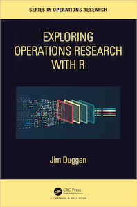

### Exploring Operations Research with R

*Management is the process of converting information into action. The conversion process we call decision making.* [**Jay W. Forrester**](https://en.wikipedia.org/wiki/Jay_Wright_Forrester), [*Industrial Dynamics (1961)*](https://www.amazon.co.uk/Industrial-Dynamics-Jay-W-Forrester/dp/1883823366).

### Exploring-OR-with-R-Workshop

Material to support my [OR66](https://www.theorsociety.com/ORS/Events/2024/OR66/OR66.aspx?EventKey=OR66&EventKey=OR66&WebsiteKey=c1745213-aec0-45e5-a960-0ec98ebabd4e) Workshop **Making an Impact - Exploring Operations Research with R** in Bangor, September 2024.

There are five objectives of the workshop, which are to:

* Setup your own account on [posit.cloud](https://posit.cloud/)
* Use the option **New Project from Git Repository**, and enter https://github.com/JimDuggan/Exploring-OR-with-R-Workshop.
* Explore what a *tibble* is, and how it can store rectangular data
* Understand how to plot data from *tibbles* using the [ggplot2](https://ggplot2.tidyverse.org) library.
* Understand how the [dplyr](https://dplyr.tidyverse.org) library can be used to manipulate data.
* Explore and run the four case studies: (1) Exploratory Data Analysis, (2) Linear Programming, (3) Agent Based Simulation and (4) System Dynamics.

The R code examples are in the directory [code](https://github.com/JimDuggan/Exploring-OR-with-R-Workshop/tree/main/code).

All slides are in the directory [slides](https://github.com/JimDuggan/Exploring-OR-with-R-Workshop/tree/main/slides).

Once your project is created, open the file `install_packages.R` in the `setup` folder, and click on the button called "Source", as this will run the file.

Any of the R files should then run ok.

### Supporting text book
This is the code repository for my new book [*Exploring Operations Research with R*](https://www.routledge.com/Exploring-Operations-Research-with-R/Duggan/p/book/9781032277165).

    

The idea behind the book is to show how the [R Programming language](https://www.r-project.org/about.html) can be a valuable tool that can be successfully applied to the field of [operations research (OR)](https://www.theorsociety.com). 

This approach is centred on the idea of the future OR professional as someone who can combine knowledge of key OR techniques (e.g. simulation, linear programming, data science, and network science) with an understanding of progranming languages such as R, including tools for  data representation, manipulation, and analysis. 

The aim of the book is to provide a self-contained introduction to R (both Base R and the tidyverse) and show how this knowledge can be applied to a range of OR challenges in the domains of public health, infectious diseases, and energy generation, and so provide *a platform to develop actionable insights to support decision making*.

For additional resources relating to this book, check out the book's [GitHub site](https://github.com/JimDuggan/explore_or).
